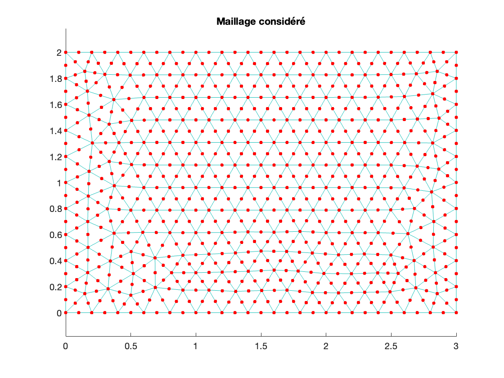
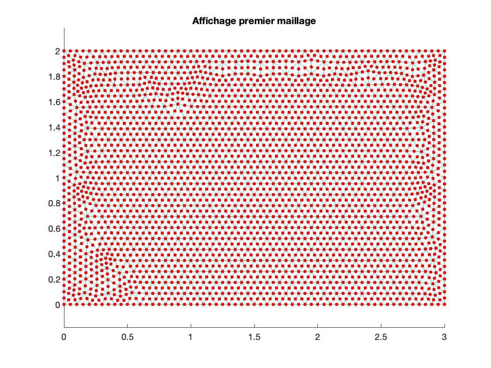

# Éléments Finis Simulation
> Le premier TP se focalise sur l'implémentation basique de la méthode des éléments finis sur une équation de poisson, lorsque le deuxième TP va bien plus loin en permettant de simuler l'écoulement d'un fluide visqueux incompressible et stationnaire dans un canal bidimensionnel avec une modélisation par des équations de stockes, avec bien plus de paramètres, de conditions aux limites à prendre en compte, et même à la fin une marche à l'entrée de ce canal

#### Sommaire 
* [Chemins](#chemins)
* [Liens aux dossiers](#liens-aux-dossiers)
* [Utilisation de gmsh](#utilisation-de-gmsh)
* [Octave comme alternative à Matlab](#octave-comme-alternative-à-Matlab)

## Chemins 
```
Upgraded_Chess_Engine/
├── Éléments finis P1/
│   ├── Codes/              # les codes Matlab du TP
│   └── Rapport/            # le rapport et les résultats du TP
│
└── Éléments finis P2/
    ├── Codes/              # les codes Matlab du TP
    └── Rapport/            # le rapport et les résultats du TP
```

## Liens aux dossiers
* [Éléments finis P1](./TP1/) 
    * [Codes](./Chess_Engine/Codes/) : les codes Matlab du TP
    * [Rapport](./Chess_Engine/Rapport/) : le rapport et les résultats du TP
* [Éléments finis P2](./TP2/)
    * [Codes](./Chess_Engine/Codes/) : les codes Matlab du TP
    * [Rapport](./Chess_Engine/Rapport/) : le rapport et les résultats du TP

## Utilisation de gmsh
#### Télécharger l'application
Voic le lien pour télécharger gmsh et ainsi pouvoir faire, modifier des maillages : http://gmsh.info
#### Télécharger l'outil de ligne de commande 
J'ai aussi installé l'outil de ligne de commande avec homebrew, étant sur MacOs, la procédure peut changer sur windows
```
brew install gmsh
```
#### Utiliser l'outil de ligne de commande
Maintenant, pour l'utiliser, j'ai utilisé une commande Matlab, qui permet d'actualiser le maillage, après avoir par exemple modifier le nombre de noeuds (voir le TP2 et les codes d'automatisation du changement du paramètre h du maillage) (le chemin à l'outil gmsh changera bien sûr sur une machine Windows)
```
system('/opt/homebrew/bin/gmsh geomRectangle_partie3_marche.geo -2 -order 2 -o geomRectangle_partie3_marche.msh');
```
#### Un résultat pour montrer l'impact de la commande 
<div style="display: flex; justify-content: space-around; align-items: center;">
  
  
</div>


## Octave comme alternative à Matlab 
On peut télécharger Octave qui est gratuit comparé à Matlab en choisissant la méthode qui correspond à notre matériel : https://octave.org/download