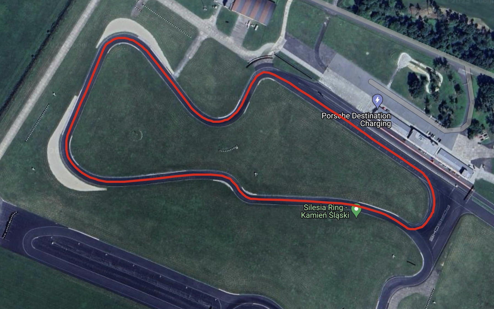
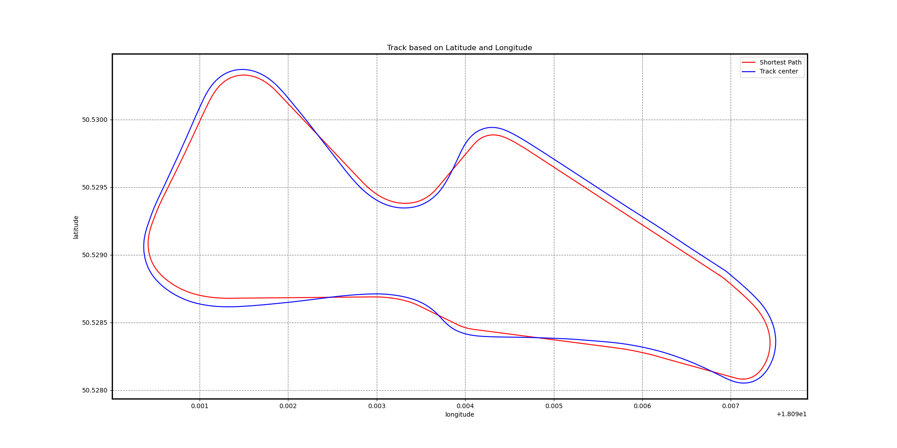
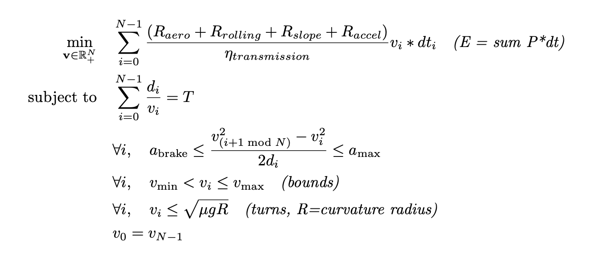
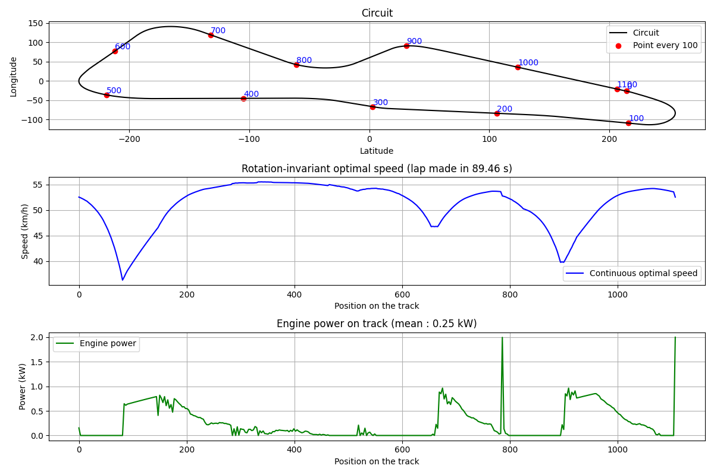
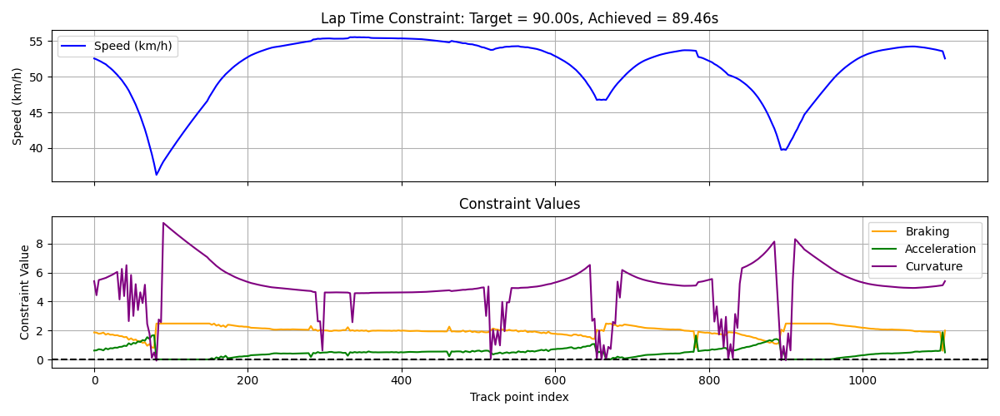

# PIE Vehicule Dynamic
> On top of building a vehicle for the Shell Eco Marathon Challenge, this competition requires us to solve an optimization problem. We need to make a certain amount of racing lap within a target lap time. This project here focus on finding the optimal speeds and power output needed to perform as best as possible in the challenge. The following is still quite general, but we only need to change the parameters to fit our vehicle to make it working for the challenge. For the real challenge, a control part for the autonomous driving will be done by others members so the vehicle can adapt to different scenarios and environnment *(for example, dealing with others users or staying on the optimal trajectory)*


#### Tables of contents
* [Path tree](#path-tree)
* [Direct links to folders](#direct-links-to-folders)  
* [About the Shell Eco Marathon Challenge](#about-the-shell-eco-marathon-challenge)
* [Previously done](#previously-done)
* [Modelisation](#modelisation)
* [Results](#results)
* [Possible improvements](#possible-improvements)


## Path tree
```
PIE_Vehicule_Dynamic/
├── Data/
│
├── Tests/
│   └── source code           
│
├── Visuals/
│  
└── source code
```


## Direct links to folders  
* [Data](./Data/) : csv file with the shortest path on the track
* [Tests](./Tests/) : different steps to come to the final result  
* [Visuals](./Visuals/) : graph outputs


## About the Shell Eco Marathon Challenge
The **Shell Eco-marathon** is a global competition that challenges students to design, build, and drive the most energy-efficient vehicles. The event brings together teams from around the world to push the boundaries of fuel efficiency and sustainable mobility.  

#### Objectives  
- **Energy Efficiency:** Develop a vehicle that consumes the least amount of fuel or energy over a set distance.  
- **Innovation & Engineering:** Apply advanced engineering principles to optimize aerodynamics, materials, and powertrain efficiency.  
- **Real-World Impact:** Encourage sustainable transportation solutions by fostering research in energy-efficient technologies.  

#### Competition Categories  
The challenge is divided into different categories based on the type of vehicle and energy source:  
1. **Prototype:** Ultra-lightweight, futuristic vehicles focused solely on efficiency.  
2. **Urban Concept:** More practical, city-oriented vehicles that resemble real-world cars.  
3. **Autonomous Urban Concept:** subcategory of Urban Concept, where autonomous vehicles must complete a course without driver intervention, showcasing autonomous driving technologies and energy optimization, reflecting current industry trends *(the category we are competing in, though not yet advanced enough to qualify for the real-world event)*.

**Energy Sources:** Vehicles can be powered by gasoline, battery-electric systems, hydrogen fuel cells, or alternative fuels.  

#### More Information
For detailed information about the competition, we encourage you to visit the official [Shell Eco-marathon website](https://www.shellecomarathon.com). This site provides comprehensive insights into the event's history, categories, and global participation.

Additionally, you can explore the official [track data page](https://telemetry.sem-app.com/wiki/doku.php/telemetry_data/tracks), which includes direct access to telemetry and detailed data for the various tracks around the world. This resource can help you better understand the specific conditions and challenges of each location, to start working on it.


## Previously done
The real track look like this on Google Maps, with the path given by the organization



After downloading the datas, I found the shortest path *(for my modelling)* through the track. At the end of the day, instead of covering 1,319 meters per lap, we only need to complete 1,272 meters. This 47-meter reduction could be a game-changer in a challenge where maximizing the energy available at the end of a given number of laps is what determines the performance.



All of this can be found in the following GitHub repositery : https://github.com/tomcuel/PIE_Trajectory_Optimisation


## Modelisation
To model the physic of the vehicle, I used to [this document](./DYN-Dynamique.pdf). I didn't include the "essieu moteur" things since our vehicle doesn't have a transmission system, and here are the different parameters values taken for the moment, that could be changed depending on the vehicle and challenge specs : 
```py
# === Parameters ===
M = 100  # kg
m_roue = 1  # kg
Cx = 0.12
Sf = 0.3
rho_air = 1.2
Crr = 0.0015
g = 9.81
mu = 0.8
r_roue = 0.3
eta_transmission = 0.9
P_max = 2000  # W
Max_speed = 20  # m/s
Min_speed = 5  # m/s
a_brake_max = 2.0  # m/s²
a_max = 0.5 # m/s²
T_lap = 90  # Target lap time in seconds
```
Here is the full optimization problem : 



Here it's doing as if the vehicle was launched with an initial speed but it could be modify to take this into account but just calculating what a real start will cost, and then doing the other laps with this output.

## Results
We can see on the results that the speeds remains pretty much constant (15km/k differences at most) to preserve energy consumption, but when there are turns, the vehicle slowdowns to accelerate again after the curves. The power is also following the same pattern, and the constraint detects curves, acceleration and braking limits.






## Possible improvements
- Using less "black box" method, like I did during various others project, but it would have take way more time, not to use the scipy.optimize library
- The modelisation could take more parameters, so the physics better fit the reality and its complexity 
- I skipped half the points to make things faster to solve, but with greater time available, all points could be considered
- Power outputs could be saved in a csv file and adapted to the vehicle component as a tension to deliver but that's not that much important. It could be done later 
