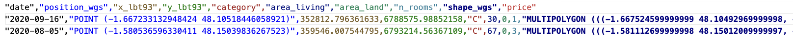
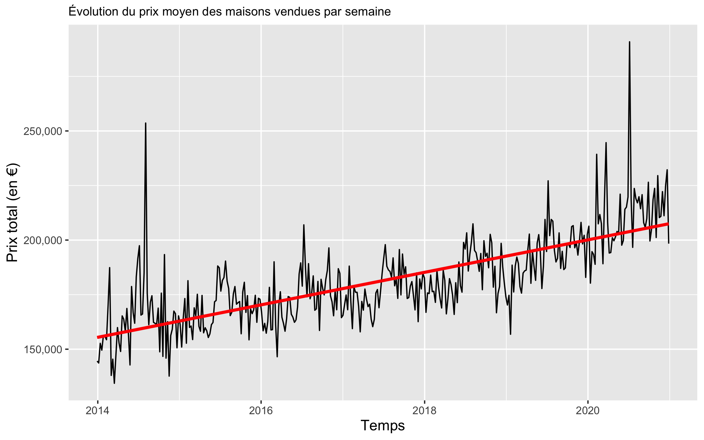
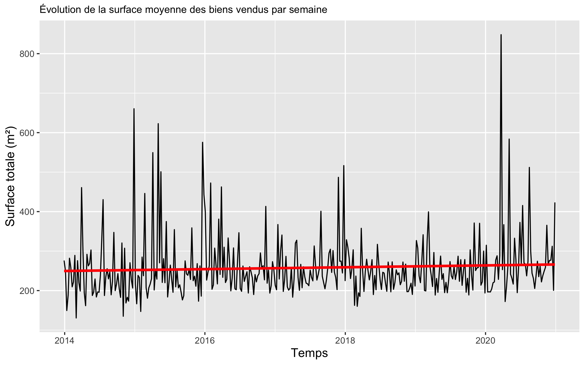
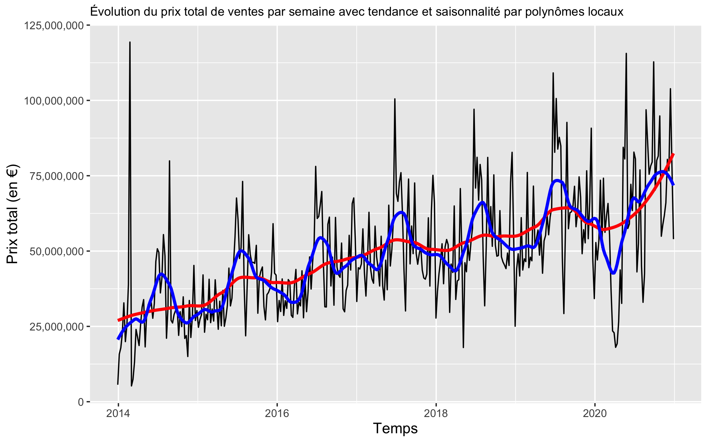
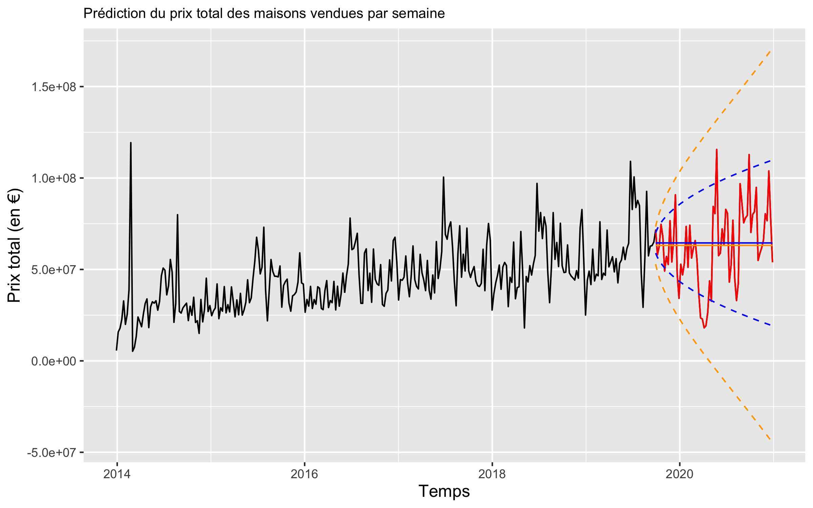

# Real Estate Market Analysis Project 
> In the context of a statistics lesson on time series, this project analyzes the real estate market in Ille-et-Vilaine, France. Using historical transaction data, we aim to identify key factors influencing house prices and develop simple predictive models to estimate future prices.

The dataset can be found on the Kaggle website via this link (https://www.kaggle.com/datasets/cheneblanc/housing-prices-35-fr), or by searching for its name: Housing Prices France 35. Due to size constraints on GitHub, the dataset is not available in the repository. However, a sample of the dataset, containing only the relevant columns for modeling, is provided. All code is based on the initial dataset, though representative datasets can be used with minor adjustments.

#### Tables of contents
* [Path Tree](#path-tree)
* [Direct Links to Folders](#direct-links-to-folders)  
* [Running the code](#running-the-code) 
* [Overview](#overview)
* [Data Processing](#data-processing)
* [Dataset Description](#dataset-description)
* [Descriptive Analysis](#descriptive-analysis)
* [Trend and Seasonality Extraction](#trend-and-seasonality-extraction)
* [Price Prediction](#price-prediction)

## Path tree
```
Real_Estate_Market_Analysis_Project /
├── Datasets/
│   └── datasets
│
├── Results/
│   ├── Data_Cleaning/                
│   ├── Prediction/    
│   ├── Raw_Graphs/
│   └── Tendance_Saison/
│
└── R code
```

## Direct links to folders
* [Datasets](./Datasets/) : folder containing the datasets
* [Results](./Results/) : contains the figures you get when computing the R code
    * [Data_Cleaning](./Results/Data_Cleaning/) : figures used to visualize data treatment steps 
    * [Prediction](./Results/Prediction/) : prediction related figures
    * [Raw_Graphs](./Results/Raw_Graphs/) : raw representation of the datas 
    * [Tendance_Saison](./Results/Tendance_Saison/) : graphs related to getting trends and saisonnality 


## Running the code 
You must have install R, either using it directly in VS-Code, or R-Studio (simpler but worst to code on I think)

On top of that you must install packages before using them  by making the following commmandes
```
install.packages("to_use")
library(to_use)
```
In this project, I used for different purpose the librairies just below :  
```
xts
dplyr
tidyr
dygraphs
lubridate
caret
ggplot2
GGally
corrplot
nortest
scales
zoo
mgcv
forecast
```

## Overview 
* Data preprocessing (outlier removal, missing value treatment, normalization).
* Exploratory data analysis (distribution, trends, seasonality).
* Statistical modeling (Gaussian kernel smoothing, polynomial regression, moving averages).
* Time series forecasting (exponential smoothing, validation, and prediction).
* More details in the report [See the PDF report](rapport.pdf)

## Dataset Description
The dataset contains key attributes about real estate properties:
* date: transaction date.
* area_land, area_living: Total living area (in m²).
* price: sale price of the property.
* position_wgs, x_lbt93, y_lbt93, category, n_rooms, shape_wgs: non useful additional information 


We first analyze the distribution of these attributes and clean the dataset before performing modeling and predictions.

## Data Processing
To ensure data quality, we applied the following preprocessing steps:

#### Outlier Detection and Removal
* Initial price distribution analysis revealed extreme values.
* Used boxplots and interquartile range (IQR) filtering to remove outliers.
* Applied a log transformation to normalize price distributions.

#### Handling Missing Values
* Identified missing values in price and room count attributes.
* Used linear regression imputation based on correlated features.

#### Data Normalization
* Standardized numerical features for better model performance.

After cleaning, the dataset was exported for further modeling and analysis.

## Descriptive Analysis
We performed time-series visualization to detect trends and seasonal patterns:
* Sales prices are increasing, reflecting inflation and rising property demand.
* Price per square meter is rising, showing market expansion, while areas don't move.
* Number of transactions follows a seasonal pattern, with higher sales in summer and lower in winter.
* The COVID-19 pandemic had a temporary effect on transactions.

Here are some raw graphs as examples : 




## Trend and Seasonality Extraction
To analyze trends, we applied several smoothing techniques:

#### Moving Averages
* Used a 40-period window for trend extraction.
* Used a 10-period window for seasonality extraction.

#### Gaussian Kernel Smoothing
* Applied a Gaussian filter to smooth price trends.
* Evaluated autocorrelation to verify model accuracy.

#### Local Polynomial Regression
* Modeled price evolution using local polynomial approximations.
* Compared residual autocorrelation with previous methods.



#### Exponential Smoothing
* Implemented simple and double exponential smoothing.
* Tuned hyperparameters (α) to minimize prediction errors.

## Price Prediction
We built predictive models using historical data to estimate future prices.



#### Prediction on Known Data
* Tested models against existing data to evaluate performance.
* Local polynomials outperformed Gaussian kernels, which sometimes predicted negative prices.

#### Cross-Validation
* Validated models using cross-validation.
* Found that Gaussian models had significant prediction errors.

#### Forecasting Future Prices
* Predicted price trends for the next year.
* Oserved a decline in total sales, likely due to COVID-19 market disruptions, since it's predicting the year after